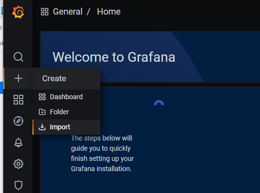
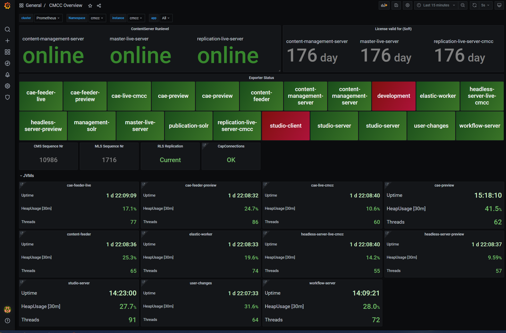

# grafana-dashboard

## Setup
Based on [jmx_exporter](https://github.com/prometheus/jmx_exporter) metrics
### prometheus jmx exporter
Activate prometheus exporter in coremedias applicationbase image via the following ENV:
```
PROMETHEUS=true
```
### ContainerPorts
Add metric port to deployments/statefulsets
```yaml
        - containerPort: 8199
          name: metrics
          protocol: TCP
```

### Prometheus scraping
Prometheus needs to scrape the metrics. Depending on the prometheus setup used, diffferent strategies can be used.
#### Pod annotations

```yaml
  template:
    metadata:
      annotations:
        prometheus.io/scrape: "true"
        prometheus.io/port: "8199"
        prometheus.io/path: /metrics
```

#### PodMonitor 
CRD provided by [prometheus-operator](https://github.com/prometheus-operator/prometheus-operator). Also used in [kube-prometheus-stack](https://github.com/prometheus-community/helm-charts/tree/main/charts/kube-prometheus-stack)
```yaml
apiVersion: monitoring.coreos.com/v1
kind: Prometheus
metadata:
  name: prometheus
spec:
  serviceAccountName: prometheus
  podMonitorSelector:
    matchLabels:
      app.kubernetes.io/instance: cmcc
```
## Dashboards
dashbords can be imported by clicking import and pasting the json-config:


### CMCC Overview
quick overview of installed cmcc-components


### CapClients Overview
quick overview of components with cap-clients. Each panel contains a link to the cap-client details dashboard.


### CapClients Details
Details about Cap-client in a component
### JVM 
adapted from [JMX Overview](https://grafana.com/grafana/dashboards/3457)

### CacheDetails
dashboard to take a more detailed look into caches of cmcc-components.
